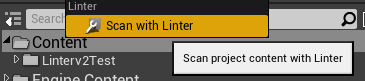

# Getting Started

## Requirements

* You will need a launcher version of Unreal Engine 4 version 4.24 or later.
* You must purchase (for free) the Linter plugin on the Unreal Engine Marketplace.

@TODO: Add link here once I have it

## Installing From The Launcher

1. Close all your instances of Unreal Engine 4
2. Using the Epic Launcher find Linter in your Vault
3. Use the Install to Engine button to install Linter to your Engine

## Enabling Linter

1. Open your project
2. Open the Plugins window by clicking Edit on the main toolbar and navigating to Plugins
3. Search for Linter
4. Enable the Linter plugin by ensuring the Enabled checkbox is checked
5. Restart the editor

## Using Linter

Once installed there isn't much in the way of using Linter. Operating Linter is pretty straightforward:

1. Right-click on a content folder in your project
2. Click "Scan with Linter"
3. Select the ruleset you would like to use for linting
4. Wait for the results

## The Lint Report

Once a project is scanned, you will be presented with a Lint Report that provides an overall summary of the state of your project.

